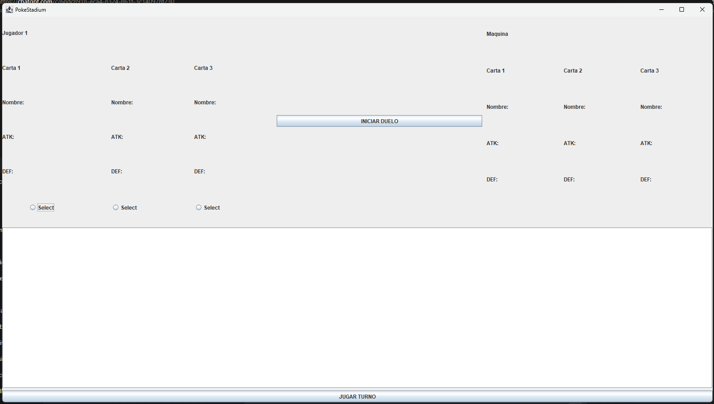
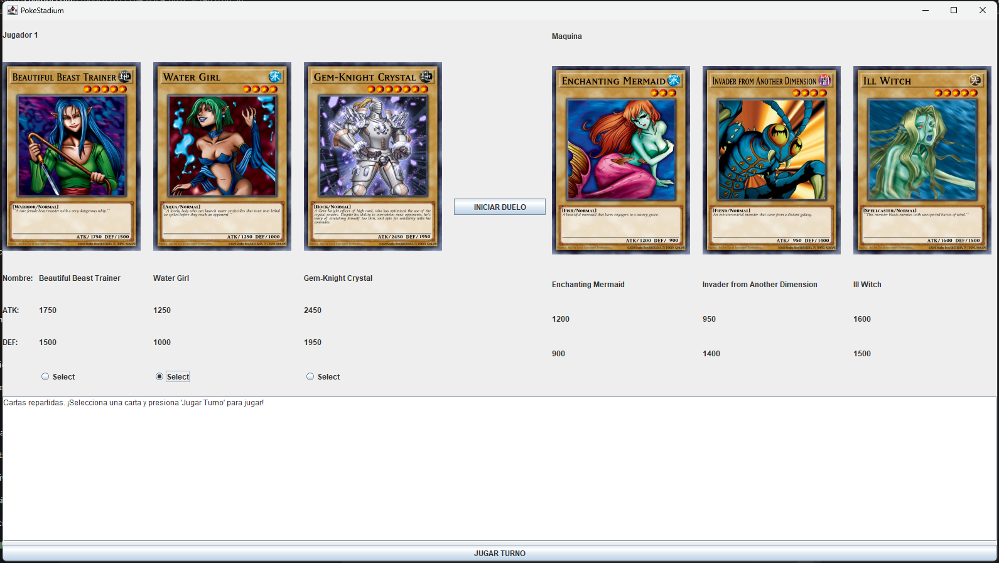
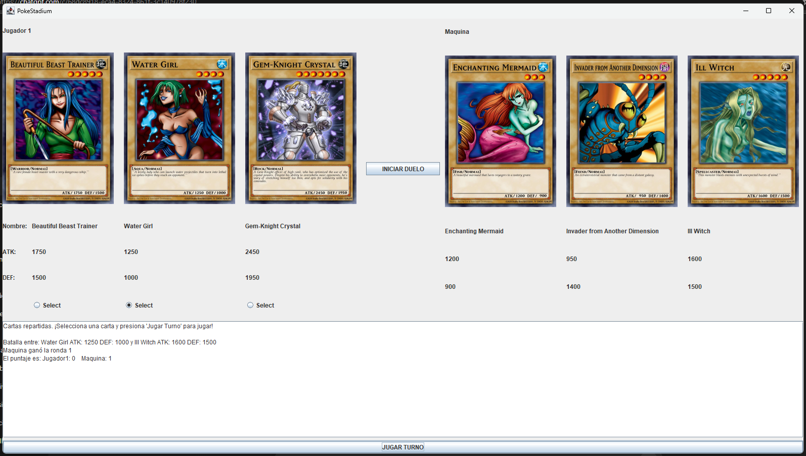
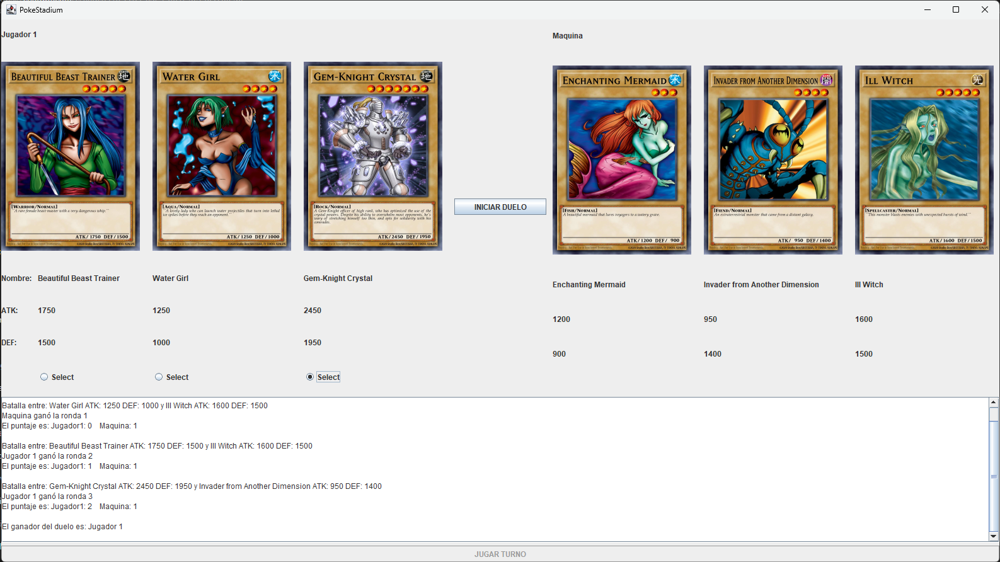

# Laboratorio 1 - Desarrollo de Software 3

Julian Potes Villada - 2266135

## Instrucciones de uso aplicación de duelos YugiOh (YugiApi)

1. El botón Iniciar dará comienzo al duelo, repartiendo tres cartas aleatorias a cada jugador.
2. Una vez que ambos jugadores tengan sus cartas, el Jugador 1 podrá seleccionar una para jugar el turno, mientras que la carta de la Máquina será escogida aleatoriamente de su mazo.
3. En cada turno, el ATK de la carta del Jugador 1 se comparará con la DEF de la carta de la Máquina. Si el ATK del Jugador 1 es mayor que la DEF de la Máquina, el punto del turno será para el Jugador 1; en caso contrario, el punto será para la Máquina.
4. El primer jugador en ganar 2 de 3 puntos será declarado ganador del duelo.

## Explicacion del diseño

El sistema está diseñado utilizando Java Swing para la interfaz gráfica y la API de YGOProDeck para obtener cartas de manera aleatoria. Cada jugador recibe tres cartas al inicio del duelo, las cuales se muestran con su nombre, ataque, defensa e imagen correspondiente. El Jugador 1 selecciona su carta mediante botones de opción, mientras que la máquina elige una de sus cartas aleatoriamente.

El flujo del duelo compara el ATK de la carta seleccionada por el jugador con la DEF de la carta de la máquina. Los resultados se muestran en pantalla junto con los puntajes acumulados, y el primer jugador en ganar dos rondas es declarado vencedor. La aplicación está dividida en clases que representan la lógica del duelo (Duelo), las cartas (Carta) y la interfaz (YugiApi).

## Pantalla inicial
  
Pantalla inicial antes de repartir las cartas. Para comenzar el duelo, se debe presionar el botón **Iniciar Duelo**, el cual reparte las cartas de manera aleatoria.

## Pantalla inicio de turno
  
En esta pantalla ya se han repartido las cartas de forma aleatoria. El jugador puede seleccionar una carta para iniciar su turno.

## Pantalla turno
  
En esta pantalla se muestra la información del turno: las cartas que se enfrentan, sus valores de **ATK** y **DEF**, el ganador de la ronda y el puntaje acumulado.

## Pantalla desarrollo del duelo
  
En esta pantalla se observa el desarrollo completo del duelo, mostrando la información de cada turno. Al finalizar, se muestra el ganador del enfrentamiento.

